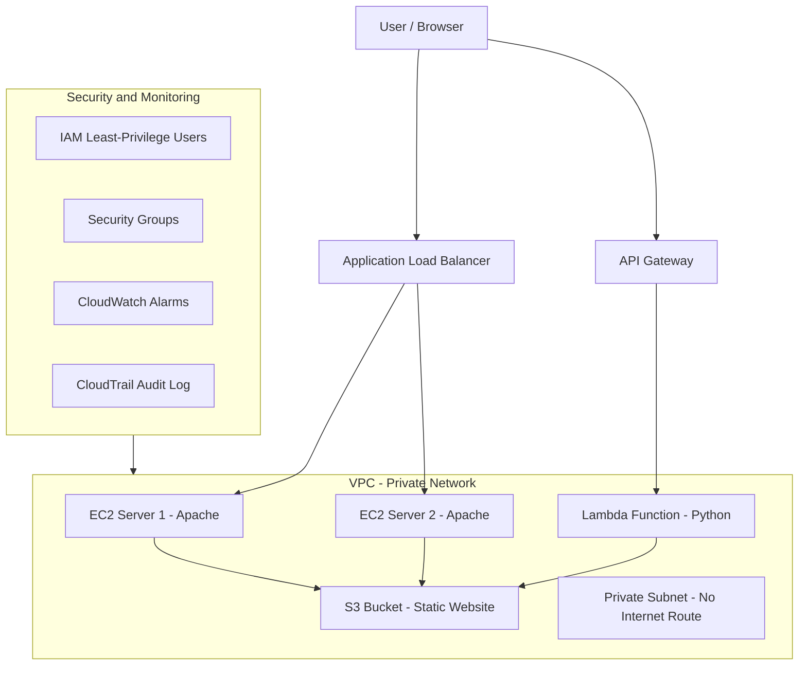

# AWS Cloud Engineering Home Lab

A hands-on AWS cloud engineering lab built from scratch using the AWS free tier. This project documents the design, deployment, and management of a multi-tier cloud infrastructure — compute, storage, serverless, load balancing, monitoring, security, and networking — all built and managed through the AWS CLI.

---

## Architecture Overview

---

## What I Built

| Service | Description | Status |
|---|---|---|
| EC2 (x2) | Two virtual servers running Apache web server | Live |
| S3 | Static website hosting with live Lambda API call | Live |
| Lambda | Serverless Python function returning JSON | Live |
| API Gateway | Public REST API endpoint connected to Lambda | Live |
| Application Load Balancer | Distributes traffic across both EC2 instances | Live |
| CloudWatch | Billing alarm ($5 threshold) + CPU alarms (80% threshold) | Live |
| SNS | Email notification delivery for CloudWatch alarms | Live |
| CloudTrail | Multi-region trail auditing all account API activity | Live |
| IAM | Least-privilege user built and verified with positive/negative testing | Live |
| VPC Subnets | Public and private subnet built from scratch with route tables | Live |
| Local AWS CLI | Installed and configured natively on Windows — no browser dependency | Live |

---

## Live URLs

- **EC2 Web Server:** http://3.150.25.101
- **S3 Static Website:** http://ramon-aws-lab-2026.s3-website.us-east-2.amazonaws.com
- **Load Balancer:** http://my-lab-alb-824026314.us-east-2.elb.amazonaws.com
- **Lambda API:** https://ycc7afva43.execute-api.us-east-2.amazonaws.com/default/my-first-function

---

## Session Log

| Session | Date | What Was Built |
|---|---|---|
| [Session 1](sessions/session-1-account-setup-ec2.md) | Jun 9, 2026 | AWS account, MFA, IAM user, EC2, Elastic IP, SSH, CloudShell, S3 bucket |
| [Session 2](sessions/session-2-webserver-s3.md) | Jun 12, 2026 | Apache web server, EC2 website, S3 static website hosting |
| [Session 3](sessions/session-3-lambda-apigateway.md) | Jun 12, 2026 | Lambda function, API Gateway, live serverless API |
| [Session 4](sessions/session-4-load-balancer.md) | Jun 22, 2026 | Second EC2 with User Data, Application Load Balancer, target group |
| [Session 5](sessions/session-5-monitoring.md) | Jun 28, 2026 | Styled websites, SNS topics, CloudWatch billing and CPU alarms |
| [Session 6](sessions/session-6-cloudtrail.md) | Jul 9, 2026 | CloudTrail — multi-region trail, S3 log delivery, event auditing |
| [Session 7](sessions/session-7-iam-vpc-cli.md) | Jul 10, 2026 | IAM least privilege (tested), public/private VPC subnets, local CLI setup |

---

## Skills Demonstrated

**Infrastructure as Code**
- Deployed and managed all AWS resources using the AWS CLI exclusively
- Automated EC2 configuration at launch using User Data scripts
- Built security groups, target groups, listeners, and route tables entirely via CLI

**Compute**
- Launched and managed EC2 instances (Amazon Linux 2023, t3.micro)
- Configured Apache web server with custom HTML pages
- Automated second instance provisioning with User Data — zero manual SSH required

**Storage**
- S3 bucket with static website hosting and public bucket policy
- Dedicated S3 bucket for CloudTrail log storage with a scoped bucket policy
- Managed objects via CLI (cp, sync, ls, mb)

**Serverless**
- Python Lambda function returning structured JSON with CORS headers
- Connected Lambda to API Gateway for public HTTP access
- Live web page that calls the Lambda API and renders the response in real time

**Networking**
- Deployed Application Load Balancer spanning 3 Availability Zones
- Built a private VPC subnet with a dedicated route table containing zero internet routes
- Verified public vs private subnet behavior directly through route table inspection

**Security and IAM**
- Enabled MFA on the AWS root account
- Created a least-privilege IAM user and verified it with positive and negative access tests (read succeeded, write and EC2 access correctly denied)
- Practiced proper access key lifecycle — create, test, immediately delete

**Governance and Auditing**
- Enabled a multi-region CloudTrail trail
- Verified log delivery to S3 and queried real API events showing identity, source IP, and timestamp

**Monitoring**
- CloudWatch billing alarm (alerts above $5)
- CloudWatch CPU alarms on both EC2 instances (alerts above 80%)
- SNS email delivery for all alarms
- Detailed EC2 monitoring enabled (1-minute metric intervals)

---

## Infrastructure Details

| Resource | Value |
|---|---|
| Region | us-east-2 (Ohio) |
| VPC | vpc-0b4590f07ebb14c5b |
| Instance 1 | i-0351bbe8831d04f1e |
| Instance 2 | i-0ab56766b7468d9bd |
| Elastic IP | 3.150.25.101 |
| Load Balancer | my-lab-alb |
| S3 Bucket (Website) | ramon-aws-lab-2026 |
| S3 Bucket (CloudTrail) | ramon-cloudtrail-logs-2026 |
| CloudTrail | my-lab-trail (multi-region) |
| Availability Zones | us-east-2a, us-east-2b, us-east-2c |

---

## Background

Built alongside the GDIT AWS Cloud Practitioner instructor-led course (June 2026) and the AWS Skill Builder Cloud Practitioner Essentials course. All infrastructure deployed on AWS free tier.

**Current certifications:**
- CompTIA Security+ CE (2026) — DoD 8570 IAT Level II

**In progress:**
- AWS Certified Cloud Practitioner (exam window: Jul/Aug 2026)
- B.S. Cybersecurity and Information Assurance — Western Governors University (expected 2028)

---

## What's Next

- NAT Gateway for outbound-only internet access from the private subnet
- CloudWatch dashboard with CPU and network graphs
- AWS Config for resource configuration compliance tracking
- Post-exam project: Integrate CloudTrail logs into Splunk (via Splunk Add-on for AWS) to build cloud-native detection rules — bridging this lab with the Splunk SOC Lab

---

## Related Projects

- [Splunk SOC Lab](https://github.com/rvera3426/Splunk-Soc-Lab) — Home SIEM lab running Splunk Enterprise with detection rules, dashboards, and incident response documentation

---

*Built on AWS free tier — all services within free tier limits*
