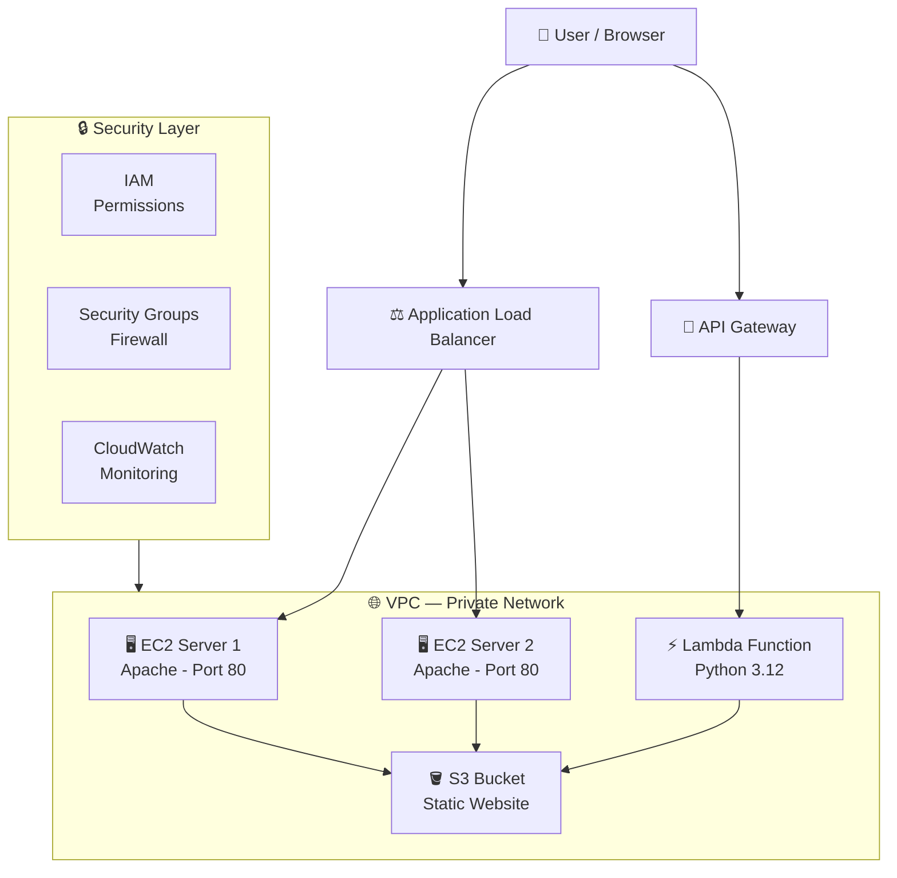

# AWS Cloud Engineering Home Lab

A hands-on AWS cloud engineering lab built from scratch using the AWS free tier. This project documents the design, deployment, and management of a multi-tier cloud infrastructure including compute, storage, serverless functions, and load balancing — all managed through the AWS CLI and Management Console.

---

## Architecture Overview



---

## What I Built

| Service | Description | Status |
|---|---|---|
| EC2 (x2) | Two virtual servers running Apache web server |Live|
| S3 | Static website hosting with public bucket policy |Live |
| Lambda | Serverless Python function returning JSON response |Live|
| API Gateway | Public REST API endpoint connected to Lambda |Live|
| Application Load Balancer | Distributes traffic across both EC2 instances |Live|
| IAM | Admin user with least privilege access |Configured|
| Security Groups | Firewall rules for EC2 and Load Balancer |Configured|
| Elastic IP | Static public IP for Server 1 |Configured|
| VPC | Private network spanning 3 Availability Zones |Configured|

---

## Live URLs

- **EC2 Web Server:** http://3.150.25.101
- **S3 Static Website:** http://ramon-aws-lab-2026.s3-website.us-east-2.amazonaws.com
- **Load Balancer:** http://my-lab-alb-824026314.us-east-2.elb.amazonaws.com
- **Lambda API:** Available via API Gateway endpoint

---

## Skills Demonstrated

**Infrastructure as Code**
- Deployed and managed all AWS resources using the AWS CLI
- Automated EC2 configuration at launch using User Data scripts
- Configured security groups, target groups, and listeners via CLI

**Compute**
- Launched and managed EC2 instances (Amazon Linux 2023, t3.micro)
- Configured Apache web server with custom HTML pages
- Used User Data to automate Apache installation on second instance

**Storage**
- Created S3 bucket with static website hosting enabled
- Configured public bucket policy using IAM policy JSON
- Managed object storage via AWS CLI (cp, sync, ls, mb)

**Serverless**
- Wrote Python Lambda function returning structured JSON response
- Connected Lambda to API Gateway for public HTTP access
- Analyzed Lambda execution logs including cold start metrics

**Networking & Load Balancing**
- Deployed Application Load Balancer spanning 3 Availability Zones
- Created target group with health checks on port 80
- Registered multiple EC2 instances and verified healthy status
- Confirmed traffic distribution between instances via browser testing

**Security**
- Enabled MFA on AWS root account
- Created IAM user with least privilege access
- Configured separate security groups for EC2 and Load Balancer
- Applied principle of least privilege to .pem key file permissions

**Monitoring**
- Used CloudWatch for EC2 metrics
- Analyzed Lambda execution logs and billing duration
- Monitored target health via ALB health checks

---

## Key Commands Used

### Launch EC2 with User Data
```bash
aws ec2 run-instances \
  --image-id ami-0741dc526e1106ae5 \
  --instance-type t3.micro \
  --key-name my-lab-key \
  --security-group-ids sg-0e7ae38cc5f20b59c \
  --user-data '#!/bin/bash
yum update -y
yum install -y httpd
systemctl start httpd
systemctl enable httpd
echo "<h1>Server 2</h1>" > /var/www/html/index.html' \
  --tag-specifications 'ResourceType=instance,Tags=[{Key=Name,Value=MySecondServer}]'
```

### Create Application Load Balancer
```bash
aws elbv2 create-load-balancer \
  --name my-lab-alb \
  --subnets subnet-03340437b0d4d94aa subnet-03d61ea4c4ad0a028 subnet-04dd784ef6b5d6d12 \
  --security-groups sg-0d3241a1bff4666f9 \
  --scheme internet-facing \
  --type application
```

### Check Target Health
```bash
aws elbv2 describe-target-health \
  --target-group-arn arn:aws:elasticloadbalancing:us-east-2:615300991502:targetgroup/my-lab-targets/da44b014cd9aaaf5
```

### S3 Static Website
```bash
aws s3 website s3://ramon-aws-lab-2026 --index-document index.html
aws s3api put-bucket-policy --bucket ramon-aws-lab-2026 --policy \
  '{"Version":"2012-10-17","Statement":[{"Effect":"Allow","Principal":"*","Action":"s3:GetObject","Resource":"arn:aws:s3:::ramon-aws-lab-2026/*"}]}'
```

---

## Lambda Function

```python
import json

def lambda_handler(event, context):
    return {
        'statusCode': 200,
        'headers': {
            'Content-Type': 'application/json'
        },
        'body': json.dumps({
            'message': 'Hello from Lambda!',
            'name': 'Ramon Vera',
            'lab': 'AWS Cloud Lab',
            'status': 'running'
        })
    }
```

**Execution metrics:**
- Duration: 2.10 ms
- Billed Duration: 103 ms
- Memory Used: 36 MB of 128 MB allocated
- Cold Start: 100.84 ms

---

## Infrastructure Details

| Resource | Value |
|---|---|
| Region | us-east-2 (Ohio) |
| VPC | vpc-0b4590f07ebb14c5b |
| Instance 1 | i-0351bbe8831d04f1e |
| Instance 2 | i-0ab56766b7468d9bd |
| Elastic IP | 3.150.25.101 |
| Load Balancer | my-lab-alb |
| S3 Bucket | ramon-aws-lab-2026 |
| Availability Zones | us-east-2a, us-east-2b, us-east-2c |

---

## Session Log

| Session | Date | What Was Built |
|---|---|---|
| Session 1 | June 9, 2026 | AWS account, MFA, IAM user, EC2, Elastic IP, SSH, CloudShell, S3 bucket |
| Session 2 | June 12, 2026 | Apache web server, EC2 website, S3 static website hosting |
| Session 3 | June 12, 2026 | Lambda function, API Gateway, live serverless API |
| Session 4 | June 22, 2026 | Second EC2 with User Data, Application Load Balancer, target group, listener |

---

## Background

Built alongside the GDIT AWS Cloud Practitioner instructor-led course (June 2026) and the AWS Skill Builder Cloud Practitioner Essentials course. All infrastructure deployed on AWS free tier.

**Current certifications:**
- CompTIA Security+ CE (2026) — DoD 8570 IAT Level II

**In progress:**
- AWS Certified Cloud Practitioner (exam scheduled July/August 2026)
- B.S. Cybersecurity and Information Assurance — Western Governors University (expected 2028)

---

## Related Projects

- [Splunk SOC Lab](https://github.com/rvera3426/Splunk-Soc-Lab) — Home SIEM lab running Splunk Enterprise with detection rules, dashboards, and incident response documentation

---

*Built on AWS free tier — all services within free tier limits*
